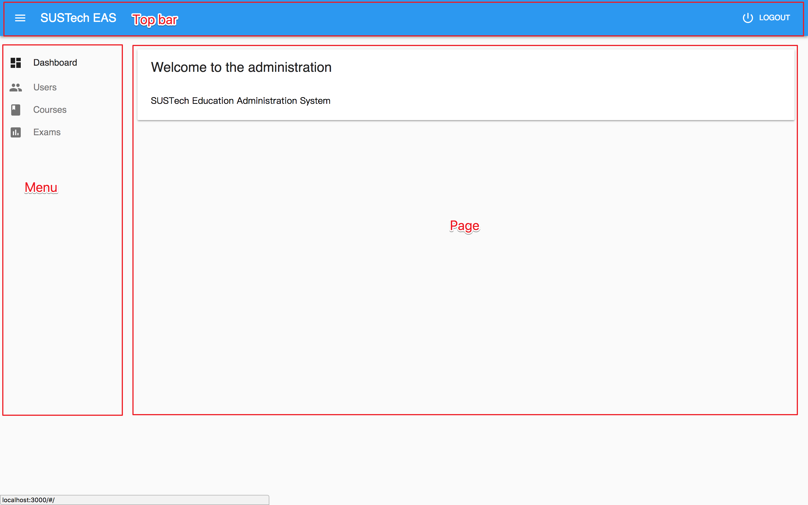

# React EAS FrontEnd

[](https://www.gnu.org/licenses/gpl-3.0)


Eduction Administration System Front End based on React Admin.


Table of Contents
=================

- [React EAS FrontEnd](#react-eas-frontend)
	+ [Design](#design)
		* [Style](#style)
		* [Structure](#structure)
		* [Layout](#layout)
	+ [Techniques](#techniques)
	+ [Installation](#installation)
		* [Prerequisites](#prerequisites)
		* [Configuration](#configuration)
	+ [Development](#development)
	+ [Demo](#demo)
	+ [Team](#team)
- [License](#license)
- [Reference](#reference)

## 1. Design

1. Style
	
	This front end uses the *material design* style. The material design style is popular front end style developed by **Google**. Details can be referred in [Material.io](https://material.io). 

2. Structure
	
	The file strcture mainly contains three parts: 
	
	- public
		+ html
		+ ico
		+ manifest file
	- src
		+ CSS
		+ JS
	- Configuration

```
	.
├── README.md
├── package-lock.json
├── package.json
├── public
│   ├── favicon.ico
│   ├── index.html
│   └── manifest.json
├── src
│   ├── App.js
│   ├── Dashboard.js
│   ├── authProvider.js
│   ├── courses
│   │   └── courses.js
│   ├── css
│   │   ├── App.css
│   │   └── index.css
│   ├── exams
│   │   └── exam.js
│   ├── index.js
│   ├── registerServiceWorker.js
│   ├── resources
│   │   └── resources.js
│   ├── roles
│   │   └── roles.js
│   ├── users
│   │   └── users.js
│   └── utils
│       └── customization.js
└── yarn.lock

10 directories, 23 files
```

3. Layout

	The structure of the front end design contains three parts:
	
	+ Top bar
	+ Menu
	+ Pages

	


## Techniques

- [x] React
- [x] React-Admin
- [x] Axios
- [x] HAL Rest

## 3. Start

### 3.1 Prerequisites

- React admin
- Yarn
- Dependencies(See `yarn.lock`)

### 3.2 Installation
	
Install Yarn if it does not exist in your computer.

For MacOS:

```bash
brew install yarn
```

For Ubuntu:

First configure the repository:

```bash
curl -sS https://dl.yarnpkg.com/debian/pubkey.gpg | sudo apt-key add -
echo "deb https://dl.yarnpkg.com/debian/ stable main" | sudo tee /etc/apt/sources.list.d/yarn.list
```

Simply update and install:

```bash
sudo apt-get update && sudo apt-get install yarn 
```

Test that Yarn is installed by running:

```bash
yarn --version
```

For details please see [Installation of Yarn](https://yarnpkg.com/lang/en/docs/install/).


After that, run

```bash
yarn install
```

to install the dependencies.

Then run

```bash
yarn start
```
to start the program in `localhost:3000`

or build by running

```
yarn build
```

## 4. Development

This front end is developed based on React Admin. We had tried using React without any framework to build the front end from scratch but it was costly and inefficient. There are some material design style web framework and we finally chose **React Admin** since it is compatible to our back end and keeps the material design style.

The front end has a login entry and shows a dashboard after logging in. The data displayed in the pages is provided by `dataProvider` which is an important component in React Admin. Our back end is using **Rest** and it can be easily modified and used in our chosen framework. 


## 5. Demo

- Login:

  

- Dashboard:

  

- Users:

  
  
 
- Course:

  
  
  

- Exams:

  


## 6. Team

- Yiming Peng: Back end and Front End
- Yilin Zheng: Front end

## License

**GPL** *v3*

## Reference

- [Material.io](https://material.io)
- [Material UI](https://material-ui.com)
- [React](https://reactjs.org)
- [Chinese Docs for React](https://doc.react-china.org)
- [React Admin](https://marmelab.com/react-admin/index.html)
- [Axios](https://github.com/axios/axios)
- [HAL Rest](http://stateless.co/hal_specification.html)